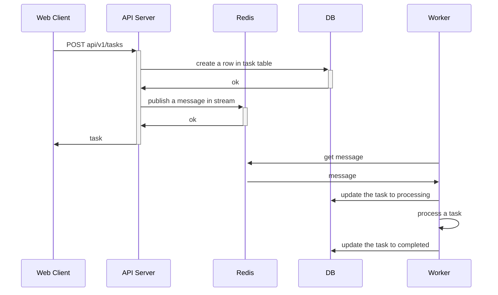

# Sequence Diagram
## Table of Contents
- API Sequence Diagram
  - [Table of Contents](#table-of-contents)
  - [Task Life Cycle](#task-life-cycle)
  
---
## Task Life Cycle

```mermaid
sequenceDiagram
    participant Web Client
    participant API Server
    participant Redis
    participant DB
    participant Worker
    Web Client->>+API Server: POST api/v1/tasks
    API Server->>+DB: create a row in task table
    DB->>-API Server: ok
    API Server->>+Redis: publish a message in stream
    Redis->>-API Server: ok
    API Server->>-Web Client: task

    Worker->>+Redis: get message
    Redis->>Worker: message
    Worker->>DB: update the task to processing
    Worker->>Worker: process a task
    Worker->>DB: update the task to completed
```
