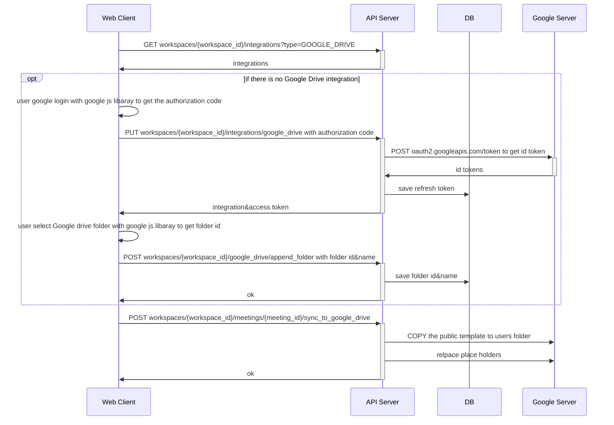
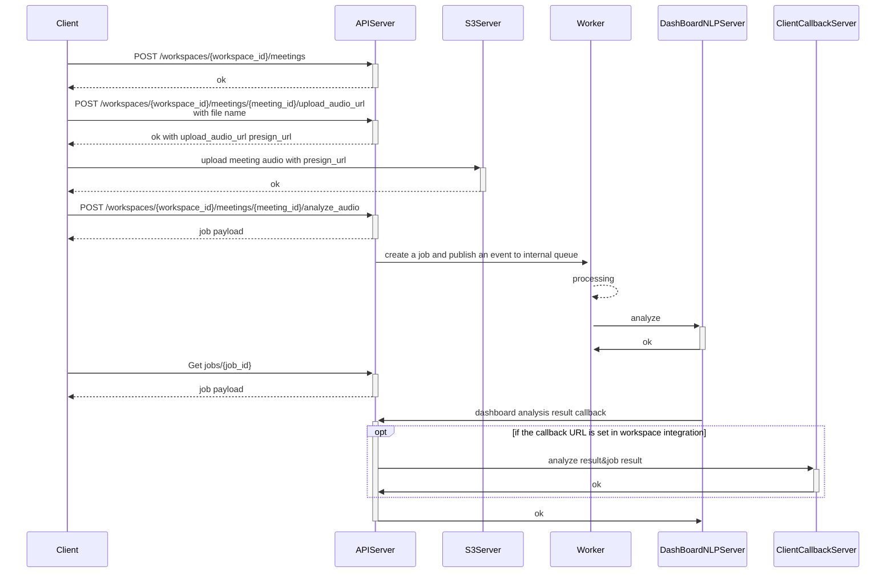
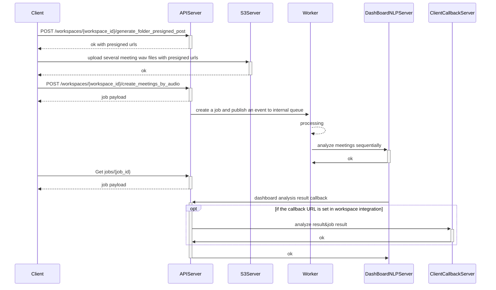

# Sequence Diagram
## Table of Contents
- API Sequence Diagram
  - [Table of Contents](#table-of-contents)
  - [Export Meeting Note to Google Drive](#export-meeting-note-to-google-drive)
  - [Import Meeting Audio](#import-meeting-audio)
  - [Create Meetings by Audio](#create-meetings-by-audio)
  
---
## Export Meeting Note to Google Drive

## Import Meeting Audio

## Create Meetings by Audio
